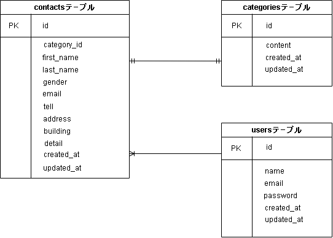

環境構築 <<お問い合わせフォーム>>

Dockerビルド
    docker-compose up -d —build

Laravel環境構築
    1. docker-compose exec php bash
    2. php artisan key:generate
    3. php artisan migrate
    4. php artisan db:seed

使用技術
- PHP 7.4.9
- Laravel 8.83.27
- MySQL 8.0.26

ER図
- 

URL
- 開発環境：http://localhost
- phpMyAdmin：http://localhost:8080/